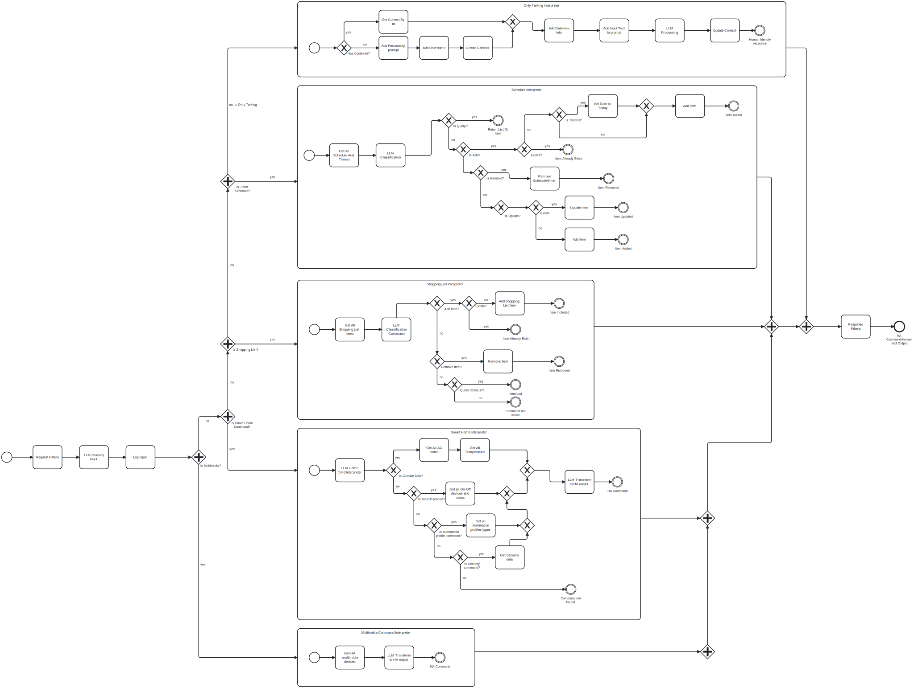

# Peruca - LLM Virtual Assistant 

Peruca is an advanced virtual assistant that utilizes large language models (LLMs) such as ChatGPT and Local AI. This repository contains everything you need to set up, integrate, and use Peruca as a virtual assistant, compatible with Node-RED and Virtual Assistant.
(UNDER CONSTRUCTION)

## Table of Contents

- [Introduction](#introduction)
- [Features](#features)
- [Prerequisites](#prerequisites)

## Introduction

Peruca is a virtual assistant designed to offer natural and contextually relevant interactions using advanced language models. It can be integrated into various platforms and services, making it easy to create customized virtual assistant solutions.

## Features

- **Compatibility with ChatGPT and Local AI**: Use the powerful language models from OpenAI or local alternatives.
- **Integration with Node-RED**: Create automated and interactive workflows.
- **Integration with Virtual Assistant**: Connect and customize your virtual assistant easily.
- **Flexibility and Extensibility**: Adapt and expand Peruca to meet your specific needs.

## Use Case Diagram

## BPMN Diagram

## Component Diagram

## Prerequisites

- **Node-RED** (optional, for integration with automated workflows)
- **OpenAI Account** (for using ChatGPT)
- **Local AI Environment** (if using a local model)
